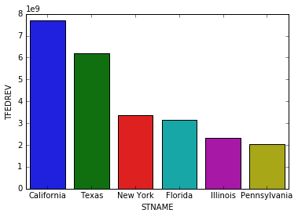
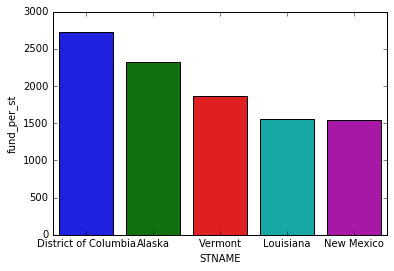
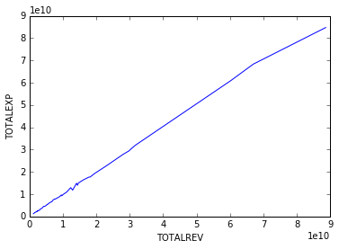
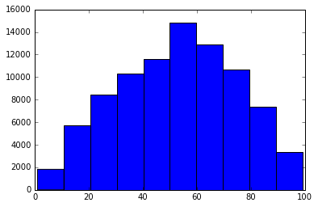

```python
import pandas as pd
import numpy as np
import seaborn as sns
import matplotlib.pyplot as plt
%matplotlib inline

```

## Problem1 Rank State by Funding and Funding per student
### After processing and plotting, we see California has highest total state funding while District of Columbia has highest funding per student


```python
# read raw fiscal dta
fiscal_data=pd.read_csv("Sdf16_1a.txt", sep='\t')
#drop missing and na for revenue
fiscal_data= fiscal_data[fiscal_data.TFEDREV > 0]
```

    C:\Users\hudie\Anaconda3\lib\site-packages\IPython\core\interactiveshell.py:2723: DtypeWarning: Columns (0,3) have mixed types. Specify dtype option on import or set low_memory=False.
      interactivity=interactivity, compiler=compiler, result=result)
    


```python
rank = fiscal_data.groupby("STNAME").sum().sort_values(by='TFEDREV', ascending=False)
rank.head(3)
```


<div>
<style scoped>
    .dataframe tbody tr th:only-of-type {
        vertical-align: middle;
    }

    .dataframe tbody tr th {
        vertical-align: top;
    }

    .dataframe thead th {
        text-align: right;
    }
</style>
<table border="1" class="dataframe">
  <thead>
    <tr style="text-align: right;">
      <th></th>
      <th>FIPST</th>
      <th>YEAR</th>
      <th>CCDNF</th>
      <th>CENFILE</th>
      <th>V33</th>
      <th>MEMBERSCH</th>
      <th>TOTALREV</th>
      <th>TFEDREV</th>
      <th>C14</th>
      <th>C15</th>
      <th>...</th>
      <th>_66V</th>
      <th>W01</th>
      <th>W31</th>
      <th>W61</th>
      <th>V95</th>
      <th>V02</th>
      <th>K14</th>
      <th>CE1</th>
      <th>CE2</th>
      <th>WEIGHT</th>
    </tr>
    <tr>
      <th>STNAME</th>
      <th></th>
      <th></th>
      <th></th>
      <th></th>
      <th></th>
      <th></th>
      <th></th>
      <th></th>
      <th></th>
      <th></th>
      <th></th>
      <th></th>
      <th></th>
      <th></th>
      <th></th>
      <th></th>
      <th></th>
      <th></th>
      <th></th>
      <th></th>
      <th></th>
    </tr>
  </thead>
  <tbody>
    <tr>
      <th>California</th>
      <td>6108</td>
      <td>16288</td>
      <td>1018</td>
      <td>1017</td>
      <td>6203559</td>
      <td>6187037</td>
      <td>89110947000</td>
      <td>7709275000</td>
      <td>1798207000</td>
      <td>1821197000</td>
      <td>...</td>
      <td>0</td>
      <td>4946663000</td>
      <td>10871931000</td>
      <td>29391495000</td>
      <td>0</td>
      <td>0</td>
      <td>0</td>
      <td>-1018</td>
      <td>-1018</td>
      <td>1018</td>
    </tr>
    <tr>
      <th>Texas</th>
      <td>58368</td>
      <td>19456</td>
      <td>1216</td>
      <td>1044</td>
      <td>5296442</td>
      <td>5296378</td>
      <td>60768409000</td>
      <td>6194317000</td>
      <td>1347799000</td>
      <td>847121000</td>
      <td>...</td>
      <td>3618330000</td>
      <td>2947662000</td>
      <td>12040448000</td>
      <td>18156976000</td>
      <td>1196458000</td>
      <td>0</td>
      <td>0</td>
      <td>41141377000</td>
      <td>4911673000</td>
      <td>1216</td>
    </tr>
    <tr>
      <th>New York</th>
      <td>24732</td>
      <td>10992</td>
      <td>687</td>
      <td>677</td>
      <td>2591958</td>
      <td>2572154</td>
      <td>67051220000</td>
      <td>3374794000</td>
      <td>1035611000</td>
      <td>699120000</td>
      <td>...</td>
      <td>2032288000</td>
      <td>428102000</td>
      <td>1425604000</td>
      <td>9234538000</td>
      <td>0</td>
      <td>0</td>
      <td>0</td>
      <td>-687</td>
      <td>-687</td>
      <td>687</td>
    </tr>
  </tbody>
</table>
<p>3 rows × 132 columns</p>
</div>


```python
sns.barplot( x = 'STNAME', y ='TFEDREV', data=rank.head(6).reset_index() )
# From the plot we see California has most funding
```


    <matplotlib.axes._subplots.AxesSubplot at 0x2282936b438>





```python
#Next we rank state by funding per student
rank['fund_per_st'] = rank['TFEDREV']/rank['V33']
rank_per_st = rank.sort_values(by="fund_per_st", ascending=False).head(5)
rank_per_st['fund_per_st']
```


    STNAME
    District of Columbia    2726.573612
    Alaska                  2319.798908
    Vermont                 1870.899241
    Louisiana               1556.713877
    New Mexico              1541.345235
    Name: fund_per_st, dtype: float64


```python
sns.barplot( x = 'STNAME', y ='fund_per_st', data=rank_per_st.reset_index() )
#we see columbia district has highest funding per student
```


    <matplotlib.axes._subplots.AxesSubplot at 0x22828d6ea90>





```python

```

## Problem2: Visualize the relationship between school districts’ total revenue and expenditures. Which states have the most debt per student?

#### From the plot we see total rev and total expenditure is positive related which makes sense as they would spend more if the get more funding( or say if the schools's expenditure is more they'll apply more funding)
#### And we see North Dakota has highest debt(rev-expenditure) per student


```python
fiscal_data = fiscal_data[fiscal_data['TOTALEXP'] > 0]
fiscal_data = fiscal_data[fiscal_data['V33'] > 0]
p2_data = fiscal_data[['STNAME','TOTALREV','TOTALEXP','V33']]
#get debt
p2_data['TOTALDEBT'] = p2_data['TOTALEXP']-p2_data['TOTALREV']
p2_data = p2_data.groupby("STNAME").sum()
#get debt/student
p2_data['debt_per_st'] = p2_data['TOTALDEBT']/p2_data['V33']
```

    C:\Users\hudie\Anaconda3\lib\site-packages\ipykernel\__main__.py:4: SettingWithCopyWarning: 
    A value is trying to be set on a copy of a slice from a DataFrame.
    Try using .loc[row_indexer,col_indexer] = value instead
    
    See the caveats in the documentation: http://pandas.pydata.org/pandas-docs/stable/indexing.html#indexing-view-versus-copy
    


```python
p2_data.head(5)
```


<div>
<style scoped>
    .dataframe tbody tr th:only-of-type {
        vertical-align: middle;
    }

    .dataframe tbody tr th {
        vertical-align: top;
    }

    .dataframe thead th {
        text-align: right;
    }
</style>
<table border="1" class="dataframe">
  <thead>
    <tr style="text-align: right;">
      <th></th>
      <th>TOTALREV</th>
      <th>TOTALEXP</th>
      <th>V33</th>
      <th>TOTALDEBT</th>
      <th>debt_per_st</th>
    </tr>
    <tr>
      <th>STNAME</th>
      <th></th>
      <th></th>
      <th></th>
      <th></th>
      <th></th>
    </tr>
  </thead>
  <tbody>
    <tr>
      <th>Alabama</th>
      <td>7607098000</td>
      <td>7864636000</td>
      <td>743789</td>
      <td>257538000</td>
      <td>346.251423</td>
    </tr>
    <tr>
      <th>Alaska</th>
      <td>2494691000</td>
      <td>2623014000</td>
      <td>132477</td>
      <td>128323000</td>
      <td>968.643614</td>
    </tr>
    <tr>
      <th>Arizona</th>
      <td>9754612000</td>
      <td>9273737000</td>
      <td>1078877</td>
      <td>-480875000</td>
      <td>-445.718094</td>
    </tr>
    <tr>
      <th>Arkansas</th>
      <td>5405694000</td>
      <td>5420487000</td>
      <td>491281</td>
      <td>14793000</td>
      <td>30.111077</td>
    </tr>
    <tr>
      <th>California</th>
      <td>88617544000</td>
      <td>84741618000</td>
      <td>6203660</td>
      <td>-3875926000</td>
      <td>-624.780533</td>
    </tr>
  </tbody>
</table>
</div>


```python
sns.lineplot(x="TOTALREV", y="TOTALEXP", data=p2_data)
```


    <matplotlib.axes._subplots.AxesSubplot at 0x22828de3c50>





```python
p2_data.sort_values(by="debt_per_st",ascending=False).head(5)
```


<div>
<style scoped>
    .dataframe tbody tr th:only-of-type {
        vertical-align: middle;
    }

    .dataframe tbody tr th {
        vertical-align: top;
    }

    .dataframe thead th {
        text-align: right;
    }
</style>
<table border="1" class="dataframe">
  <thead>
    <tr style="text-align: right;">
      <th></th>
      <th>TOTALREV</th>
      <th>TOTALEXP</th>
      <th>V33</th>
      <th>TOTALDEBT</th>
      <th>debt_per_st</th>
    </tr>
    <tr>
      <th>STNAME</th>
      <th></th>
      <th></th>
      <th></th>
      <th></th>
      <th></th>
    </tr>
  </thead>
  <tbody>
    <tr>
      <th>North Dakota</th>
      <td>1708995000</td>
      <td>1882038000</td>
      <td>108343</td>
      <td>173043000</td>
      <td>1597.177483</td>
    </tr>
    <tr>
      <th>District of Columbia</th>
      <td>2121210000</td>
      <td>2232976000</td>
      <td>82974</td>
      <td>111766000</td>
      <td>1347.000265</td>
    </tr>
    <tr>
      <th>Alaska</th>
      <td>2494691000</td>
      <td>2623014000</td>
      <td>132477</td>
      <td>128323000</td>
      <td>968.643614</td>
    </tr>
    <tr>
      <th>Nebraska</th>
      <td>4252096000</td>
      <td>4491448000</td>
      <td>315542</td>
      <td>239352000</td>
      <td>758.542444</td>
    </tr>
    <tr>
      <th>Minnesota</th>
      <td>12377927000</td>
      <td>12921241000</td>
      <td>861905</td>
      <td>543314000</td>
      <td>630.364135</td>
    </tr>
  </tbody>
</table>
</div>


```python

```

# Problem3


```python
math_data = pd.read_csv("rla-achievement-sch-sy2015-16 (1).csv")
```

    C:\Users\hudie\Anaconda3\lib\site-packages\IPython\core\interactiveshell.py:2723: DtypeWarning: Columns (13,19,21,23,27,33,35,37,39,41,47,51,53,55,57,61,67,77,79,81,83,85,87,91,103,105,107,109,111,113,115,117,121,123,125,131,133,135,137,139,145,147,149,151,159,161,165,167,173,175,177,179,187,195,211,217,219,221,223,225,227,229) have mixed types. Specify dtype option on import or set low_memory=False.
      interactivity=interactivity, compiler=compiler, result=result)
    


```python
#'ALL_RLA00PCTPROF_1516' is blurred and has range instead of numbers
# we can transform the range to a number by impute as mean, then use the data
math_data['ALL_RLA00PCTPROF_1516'].head(10)
```


    0       33
    1       31
    2       30
    3       36
    4       42
    5       27
    6    20-29
    7       25
    8    25-29
    9       22
    Name: ALL_RLA00PCTPROF_1516, dtype: object


```python
def impute_as_mean(col):
    new_col=[]
    for x in col:
        
        x=x.split('-')
        # check if value is a range, we inpute the mean
        if len(x)>1:
            low = int(x[0])
            high = int(x[1])
            mean = (low+high)/2
            new_col.append(mean)
        # check if le or ge in x, we impute the score after LE,GE
        elif'L' in x[0] or 'G'in x[0]:
            x=int(x[0][2:])
            new_col.append(x)
        # check if PS is in x, we don't have any information, then we impute a -1 to represent such missing case
        elif'PS' in x:
            x=-1
        else:
            new_col.append(int(x[0]))
    return new_col
```


```python
impute_as_mean(math_data['ALL_RLA00PCTPROF_1516'])[:20]
```


    [33,
     31,
     30,
     36,
     42,
     27,
     24.5,
     25,
     27.0,
     22,
     57.0,
     37,
     27.0,
     42.0,
     37,
     25,
     42.0,
     61,
     48,
     68]


```python
plt.hist(impute_as_mean(math_data['ALL_RLA00PCTPROF_1516']))
```


    (array([ 1822.,  5693.,  8423., 10334., 11624., 14828., 12869., 10631.,
             7359.,  3351.]),
     array([ 1. , 10.8, 20.6, 30.4, 40.2, 50. , 59.8, 69.6, 79.4, 89.2, 99. ]),
     <a list of 10 Patch objects>)





```python

```

## Problem4 You are tasked with cutting 15% of the U.S. federal budget currently being spent on funding school districts. How much money is this? Choose which school districts will have their funding cut and how this will be done.

### I suggest we first check how many schools that has revenue>expenditure, and do a equal funding cut for these schools to make the funding more efficient overall


```python
# read raw fiscal dta
fiscal_data=pd.read_csv("Sdf16_1a.txt", sep='\t')
#drop missing and na for revenue
fiscal_data= fiscal_data[fiscal_data.TFEDREV > 0]
0.15*sum(fiscal_data.TFEDREV)
```

    C:\Users\hudie\Anaconda3\lib\site-packages\IPython\core\interactiveshell.py:2723: DtypeWarning: Columns (0,3) have mixed types. Specify dtype option on import or set low_memory=False.
      interactivity=interactivity, compiler=compiler, result=result)
    


    8340411300.0


```python
fiscal_data[fiscal_data['TFEDREV']>fiscal_data['TOTALEXP']].NAME
#So we find there are only 13 schools that has funding>expenditure, thus it's not reasonable to do the whole funding cut on these ones
# we can first do a part of funding cut on these schools, then do a equal funding cut on all schools remaning, untill we get our
# 8340411300.0 funding cut goal
```


    475      Akimel O'Otham Pee Posh Charter School Inc. 1
    2747                      EASTERN CONNECTICUT REGIONAL
    2811                              EDUCATION CONNECTION
    2878                     COMMITTEE FOR SHARED SERVICES
    4539                  Greater Randolph Interlocal Coop
    4633                   Ripley-Ohio-Dearborn Sp Ed Coop
    7676                                        Wayne RESA
    10857                            WALATOWA CHARTER HIGH
    12335                              GRAND FORKS AFB 140
    12529                                    MINOT AFB 160
    15845                  REG 10 EDUCATION SERVICE CENTER
    15870                  REG 18 EDUCATION SERVICE CENTER
    17199                          Barre Supervisory Union
    Name: NAME, dtype: object


## Problem5
### I suggest we first check how many schools that has revenue>expenditure, and do a major funding cut for these schools to make the funding more efficient for our fiscal year. However, since we find there are only 13 schools that has rev>expenditure, it's not reasonable to only cut these small amount of schools. Thus, we can rely on other measurement, for example, we want cut fundings by counting student's debt, we will cut fundings for those schools that has lower student debt first.


```python

```
